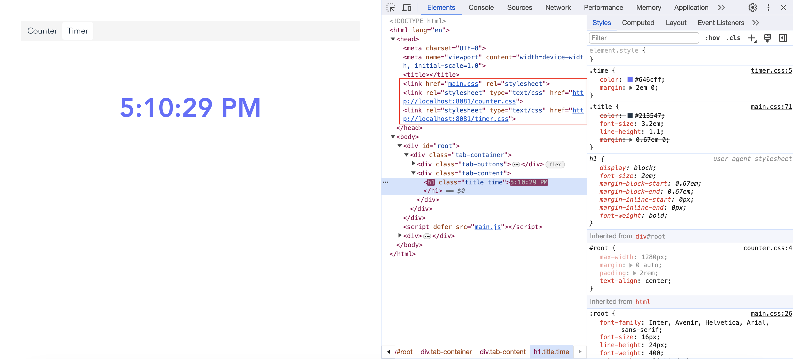
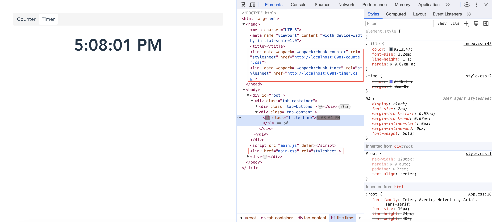

# rspack_plugin_html-inject-option-issue

This is a demo repo to reproduce the different behaviors of `rspack_plugin_html` and `html-webpack-plugin`'s `inject` option.

| html-webpack-plugin                               | rspack_plugin_html                              |
|---------------------------------------------------|-------------------------------------------------|
|  |  |

```bash
pnpm install

# webpack dev server
pnpm run dev:webpack

# rspack dev server
pnpm run dev:rspack
```
